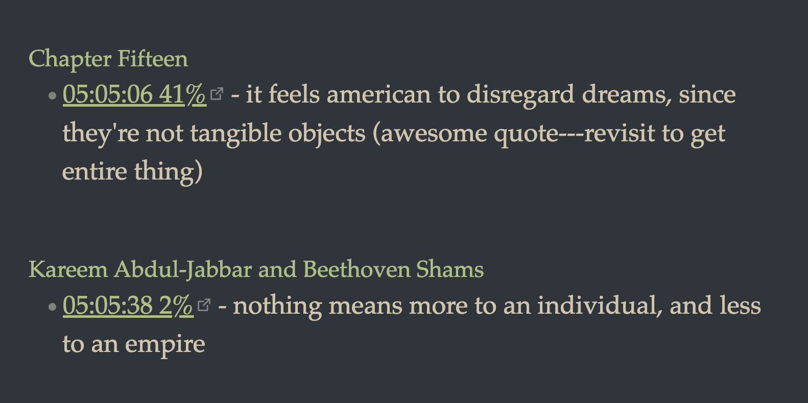
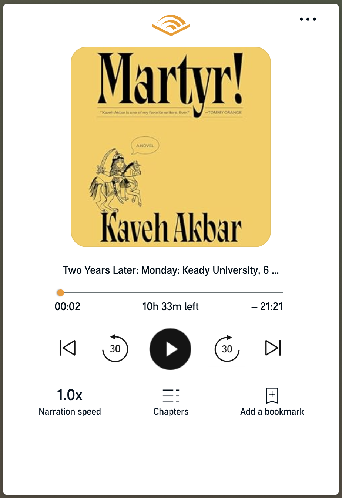
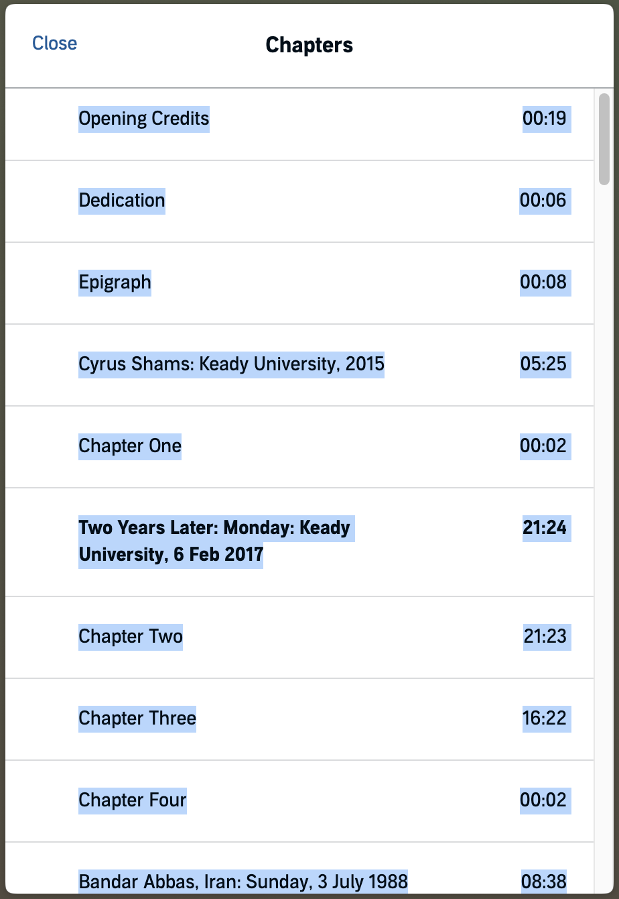
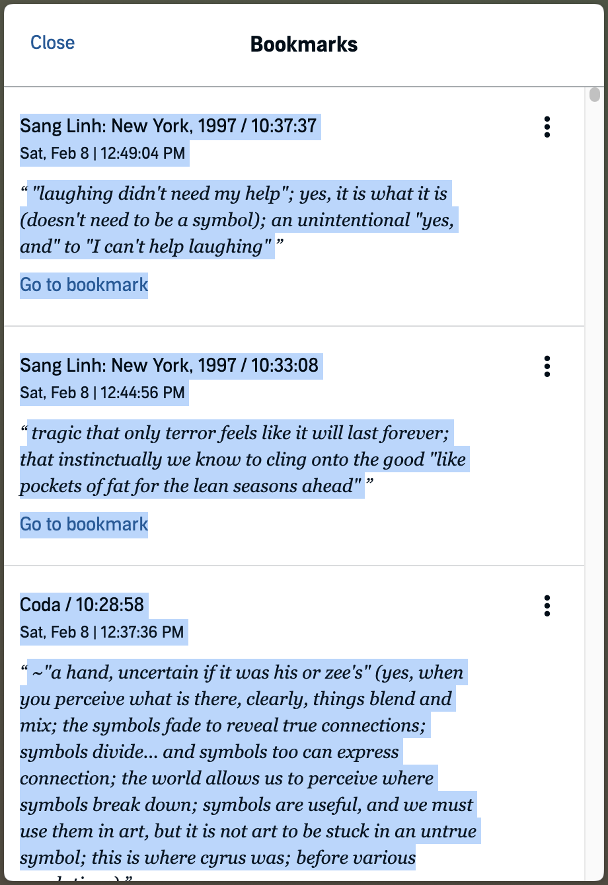

# Audible Alfred Workflow

A workflow to export Audible audiobook notes (and bookmarks) to markdown.

The output provides chapter headers of all notes, the timestamp, a percentage value (useful for finding corresponding quote in the book), and the note itself. The takes the user to the cloud player (audible ultimately does not allow direct links to bookmark locations, despite my best efforts). 

    
    
<em>Example of the markdown output format.</em>

For proper functionality, please ensure that Alfred maintains [clipboard history](https://www.alfredapp.com/help/features/clipboard/).

## How to use

After finishing an Audible audiobook, perform the following steps on your Mac:

**Step 1:** Open the book in the Audible webplayer. Navigate to [your library](https://www.audible.com/library/titles) and select the audibook of interest. 

The player should open.

    
    
<em>The Audible web player interface.</em>

**Step 2:** Copy the address bar URL to your clipboard. This is the base URL for the book. In Arc browser, you can do this with `Cmd + Shift + C`.

**Step 3:** Copy the chapters information. In the player, just below the play button, click "Chapters". Select all text beginning with the first chapter as shown below. Copy to clipboard.

    
    
<em>Selecting chapter information from the Chapters panel.</em>

**Step 4:** Copy the bookmarks information. Click "close" to get back to the player, click the three dots in the top right, and select "Bookmarks". Select all text beginning with the first bookmark as shown below. Copy to clipboard.

    
    
<em>Selecting bookmark information from the Bookmarks panel.</em>

**Step 5:** Trigger the workflow with `Ctl + Opt + Cmd + B` (the three buttons to the left of the spacebar `+ B`—feel free to reconfigure the trigger). The workflow will parse the clipboard contents and generate a *transient* clipboard item containing the markdown output. Paste this item into any text editor.

## Development

See [NOTES.md](./NOTES.md) for general development notes.

Run `python3 parse-test.py` to test the parser with the test files in this repo. It will generate a `test-output.md` file in the same directory.
